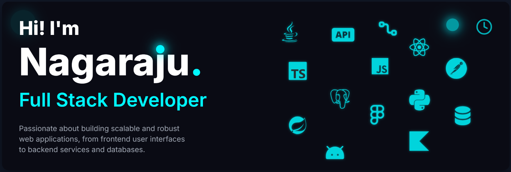

  <b>I am a full stack developer with a passion for building innovative and user-friendly applications and  looking for new challenges and opportunities to learn and grow.</b>
   

## 🛠 Tech Stack

  
  
  
  
  
  
  
  
  
  
  
  
  
  
  
  
  
  
  
  
  
  
  
  
  
  
  
  
  
  
  
  
  
  
  
  
  
  
  
  
  
  
  
  
  
  
  

###

   &nbsp
  
  

###

  

###

## 🌱 What I'm currently working on

- **Full-Stack Development**: Building scalable web applications with **React, Spring Boot, and PostgreSQL**
- **Mobile Development**: Creating modern Android applications using **Jetpack Compose** with **Firebase** backend services
- **DevOps**: Implementing **Continuous Integration and Deployment** (CI/CD) pipelines and infrastructure automation

## 📚 Deepening My Expertise

- **Advanced System Design & Architecture**: Exploring distributed systems, event-driven architectures, and cloud-native patterns
- **Performance Engineering**: Delving into low-latency optimizations, caching strategies, and database query optimization
- **Observability & SRE**: Implementing comprehensive monitoring, logging, and tracing in microservices ecosystems
- **Containerization & DevOps**: Gaining hands-on experience with Docker container optimization and implementing CI/CD pipelines using Linux-based tooling

## 🌐 Connect with Me

  
  
  
  

